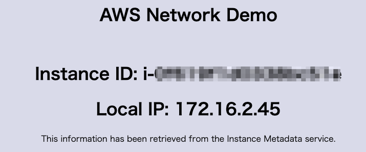

# AWS VPN Demo 

You can demonstrate the feature of VPN Connection from onpremise network to VPC on AWS.

- Demo1: AWS Client VPC authenticated with AWS SSO
- (***Work in process***)Demo2: AWS Site-to-Site VPC

# Demo1: AWS Client VPC authenticated with AWS SSO Demo

[This image created by lucid chart](https://lucid.app/lucidchart/invitations/accept/inv_09bd1e41-9c85-4f11-89bd-99bd1a028714?view_items=SkpcrWSvMDYQ%2CSkpcL0ALpZH1%2CRupcZK0qZsse%2CXtpcL24kwHfa%2CAupcPyusYpcS%2CUypcnsH5SAgv%2CSkpckB-e_dvM%2CSkpcqOsgqnbv%2CGvpcD-dOSxFO%2CovpcKnMWmutN%2CSkpc1PTlG5qO%2CCApc~VCwzivK%2CFApc3~t33TIR)

This demo is based on the following blog content.

[Authenticate AWS Client VPN users with AWS Single Sign-On](https://aws.amazon.com/jp/blogs/security/authenticate-aws-client-vpn-users-with-aws-single-sign-on/)

***Note***: The Client VPC Endpoint created in this demo will be set as "Split-tunnel" enabled. Therefore, only the specific private IPs (172.16.0.0/16 or 10.0.0.0/8) will communicate through the Client VPN, and other communications will not be affected. If you are an AWS instructor and are delivering online, you can do this demo without affecting your delivery.

## Prerequisites

- AWS SSO is configured to use the internal AWS SSO identity store.
- Some AWS SSO users for testing.
- Create the VPN client SAML application in AWS SSO
  - see "To create the VPN client SAML application:
" section for detail: [Authenticate AWS Client VPN users with AWS Single Sign-On](https://aws.amazon.com/jp/blogs/security/authenticate-aws-client-vpn-users-with-aws-single-sign-on/)
- Create the VPN client self-service SAML application
  - see "To create the VPN client self-service SAML application" section for detail: [Authenticate AWS Client VPN users with AWS Single Sign-On](https://aws.amazon.com/jp/blogs/security/authenticate-aws-client-vpn-users-with-aws-single-sign-on/)
- Integrate the Client VPN SAML applications with IAM
  - see "Integrate the Client VPN SAML applications with IAM
" section for detail: [Authenticate AWS Client VPN users with AWS Single Sign-On](https://aws.amazon.com/jp/blogs/security/authenticate-aws-client-vpn-users-with-aws-single-sign-on/)
- A client device running Windows or macOS with the latest version of Client VPN software installed. You can download it from the [AWS Client VPN download](https://aws.amazon.com/jp/blogs/security/authenticate-aws-client-vpn-users-with-aws-single-sign-on/#:~:text=AWS%20Client%20VPN%20download).

- ***Note***: VPC and ACM are not necessary to set up before, because these will be generated in the CloudFormation stack you will create later.

## How to demo

- Create Cloudformation stack by using [templates/vpn-aws-side-vpc.yaml](./templates/vpn-aws-side-vpc.yaml).
- After the stack is created, access to the client VPC Endpoint Management console, check the client VPC endpoint and copy the Self-service portal URL displayed at the bottom of the screen.
- Access to the Self-service portal url in the browser then The AWS SSO signin screen will appear, and sign in. 
- click "Download client configuration"
  - 
- Start AWS VPN Client software on your windows or mac, then add a profile for your Client VPC endpoint using the downloaded configuration in you client software.
- Click "Connect" button on you client software.
- Once you have connected the Client VPC, get the private IP address of the web instance that has been created by the stack in the Management console, and access the private ip on browser.
- If the settings worked, you can see a screen similar to the following in your browser. **Note**: The local IP varies depending on the environment.
  - 
- Or you can test to ping to the private IP too.

## Clean up

- Delete the stack.
- Delete the certficate that is automaticaly createt in the stack in AWS Certificate manager. The certificate's name is such as <stackname>-Demo-server.
- Delete two IAM Identity providers.
- Delete two SSO Applications in you AWS SSO.

# Demo2: AWS Site-to-Site VPC Demo

**Work in process**
