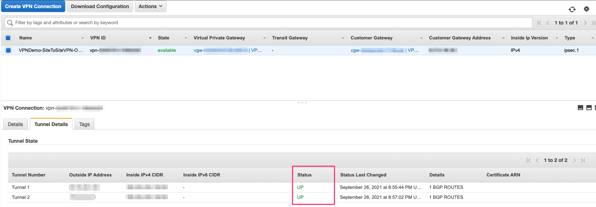
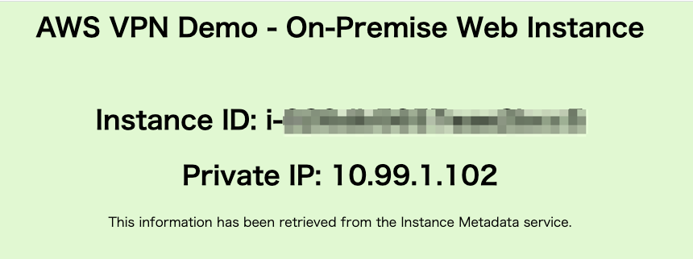

# AWS VPN Demo 

You can demonstrate the feature of VPN Connection from onpremise network to VPC on AWS.

- Demo1: AWS Client VPN authenticated with AWS SSO
- Demo2: AWS Site-to-Site VPN with Virtual Private Gateway

# Reference

Demo1 is based on the following blog content.  
- [Authenticate AWS Client VPN users with AWS Single Sign-On](https://aws.amazon.com/jp/blogs/security/authenticate-aws-client-vpn-users-with-aws-single-sign-on/)

In Demo2, the on-premises equivalent IPsec environment will be built using Strongswan. Demo2 use the Cloudformation template from the following blog post to build starting Strongswan in EC2 instance.  
- [Simulating Site-to-Site VPN Customer Gateways Using strongSwan](https://aws.amazon.com/jp/blogs/networking-and-content-delivery/simulating-site-to-site-vpn-customer-gateways-strongswan/)


# Prerequisites

- AWS SSO is configured to use the internal AWS SSO identity store.
- Some AWS SSO users for testing.
- Create the VPN client SAML application in AWS SSO
  - see "To create the VPN client SAML application:
" section for detail: [Authenticate AWS Client VPN users with AWS Single Sign-On](https://aws.amazon.com/jp/blogs/security/authenticate-aws-client-vpn-users-with-aws-single-sign-on/)
- Create the VPN client self-service SAML application
  - see "To create the VPN client self-service SAML application" section for detail: [Authenticate AWS Client VPN users with AWS Single Sign-On](https://aws.amazon.com/jp/blogs/security/authenticate-aws-client-vpn-users-with-aws-single-sign-on/)
- Integrate the Client VPN SAML applications with IAM
  - see "Integrate the Client VPN SAML applications with IAM
" section for detail: [Authenticate AWS Client VPN users with AWS Single Sign-On](https://aws.amazon.com/jp/blogs/security/authenticate-aws-client-vpn-users-with-aws-single-sign-on/)
- A client device running Windows or macOS with the latest version of Client VPN software installed. You can download it from the [AWS Client VPN download](https://aws.amazon.com/jp/blogs/security/authenticate-aws-client-vpn-users-with-aws-single-sign-on/#:~:text=AWS%20Client%20VPN%20download).

- ***Note***: VPC and ACM are not necessary to set up in advance, because these will be generated in the CloudFormation stack you will create later.

# Demo Launch Quick Commands

If you are already familiar with this demo and want to start the environment right away, please execute the following commands.

```
git clone https://github.com/tomofuminijo/aws-vpn-demo.git

cd aws-vpn-demo

aws cloudformation create-stack --stack-name VPNDemo-ClientVPN --template-body file://./templates/vpn-aws-side-vpc.yaml --capabilities CAPABILITY_NAMED_IAM
aws cloudformation wait stack-create-complete --stack-name VPNDemo-ClientVPN

aws cloudformation create-stack --stack-name VPNDemo-SiteToSiteVPN --template-body file://./templates/vpn-onpre-side-vpc.yaml --capabilities CAPABILITY_NAMED_IAM
aws cloudformation wait stack-create-complete --stack-name VPNDemo-SiteToSiteVPN

./create-strongswan.sh
aws cloudformation wait stack-create-complete --stack-name VPNDemo-strongswan
```

# Demo1: AWS Client VPC authenticated with AWS SSO


[This image created by lucid chart](https://lucid.app/lucidchart/invitations/accept/inv_09bd1e41-9c85-4f11-89bd-99bd1a028714?view_items=SkpcrWSvMDYQ%2CSkpcL0ALpZH1%2CRupcZK0qZsse%2CXtpcL24kwHfa%2CAupcPyusYpcS%2CUypcnsH5SAgv%2CSkpckB-e_dvM%2CSkpcqOsgqnbv%2CGvpcD-dOSxFO%2CovpcKnMWmutN%2CSkpc1PTlG5qO%2CCApc~VCwzivK%2CFApc3~t33TIR)

***Note***: The Client VPC Endpoint created in this demo will be set as "Split-tunnel" enabled. Therefore, only the specific private IPs (172.16.0.0/16 or 10.0.0.0/8) will communicate through the Client VPN, and other communications will not be affected. If you are an AWS instructor and are delivering online, you can do this demo without affecting your delivery.


## How to demo

- Create Cloudformation stack by using [templates/vpn-aws-side-vpc.yaml](./templates/vpn-aws-side-vpc.yaml). Execute the following command.
  ```
  cd aws-vpn-demo
  aws cloudformation create-stack --stack-name VPNDemo-ClientVPN --template-body file://./templates/vpn-aws-side-vpc.yaml --capabilities CAPABILITY_NAMED_IAM

  ```
- After the stack is created, access to the client VPC Endpoint Management console, check the client VPC endpoint and copy the Self-service portal URL displayed at the bottom of the screen.
- Access to the Self-service portal url in the browser then The AWS SSO signin screen will appear, and sign in. 
- click "Download client configuration"
  - 
- Start AWS VPN Client software on your windows or mac, then add a profile for your Client VPC endpoint using the downloaded configuration in you client software.
- Click "Connect" button on you client software.
- Once you have connected the Client VPC, get the private IP address of the web instance that has been created by the stack in the Management console, and access the private ip on browser.
- If the settings worked, you can see a screen similar to the following in your browser. **Note**: The local IP varies depending on the environment.
  - 
- Or you can test to ping to the private IP too.

# Demo2: AWS Site-to-Site VPN with Virtual Private Gateway


## Prerequisites
- Demo1 satck is already exist.

## How to demo

- Create Cloudformation stack by using [templates/vpn-onpre-side-vpc.yml](./templates/vpn-onpre-side-vpc.yaml). Execute the following command.
  ```
  aws cloudformation create-stack --stack-name VPNDemo-SiteToSiteVPN --template-body file://./templates/vpn-onpre-side-vpc.yaml --capabilities CAPABILITY_NAMED_IAM
  ```
- After the stack is created, execute the following command to start the EC2 instance that will serve as the virtual router by Strongswan.
  ```
  ./create-strongswan.sh
  ```
  In the above command, the config file of VPN Connection has been downloaded and set the VPN parameter to Strongswan that has been launched in the EC2 instans. 
  
  ***Note***: If you receive errors when running AWS Command Line Interface (AWS CLI) commands, [make sure that you’re using the most recent AWS CLI version](https://docs.aws.amazon.com/cli/latest/userguide/cli-chap-troubleshooting.html#general-latest).
  
- After the stack is created, you can confirm that both tunnels status are "UP" in management console.
  - 
- You can test to access the private IP of OnpreWebInstance in your browser. The request will be sent from your local machine to the web instance residing on the on-premises network via Client VPN and Virtual Private Gateway. If the settings worked, you can see a screen similar to the following in your browser. **Note**: The Private IP varies depending on the environment.
  - 

## Clean up

- Delete the stacks. Execute the following commands.
  ```
  aws cloudformation delete-stack --stack-name VPNDemo-strongswan
  aws cloudformation wait stack-delete-complete --stack-name VPNDemo-strongswan

  aws cloudformation delete-stack --stack-name VPNDemo-SiteToSiteVPN
  aws cloudformation wait stack-delete-complete --stack-name VPNDemo-SiteToSiteVPN
  
  aws cloudformation delete-stack --stack-name VPNDemo-ClientVPN
  aws cloudformation wait stack-delete-complete --stack-name VPNDemo-ClientVPN
  ```
- Delete the certficate in AWS Certificate manager that is automaticaly createt by the stack. The certificate's name is such as VPNDemo-ClientVPN-server.
- Delete two IAM Identity providers.
- Delete two SSO Applications in you AWS SSO.

